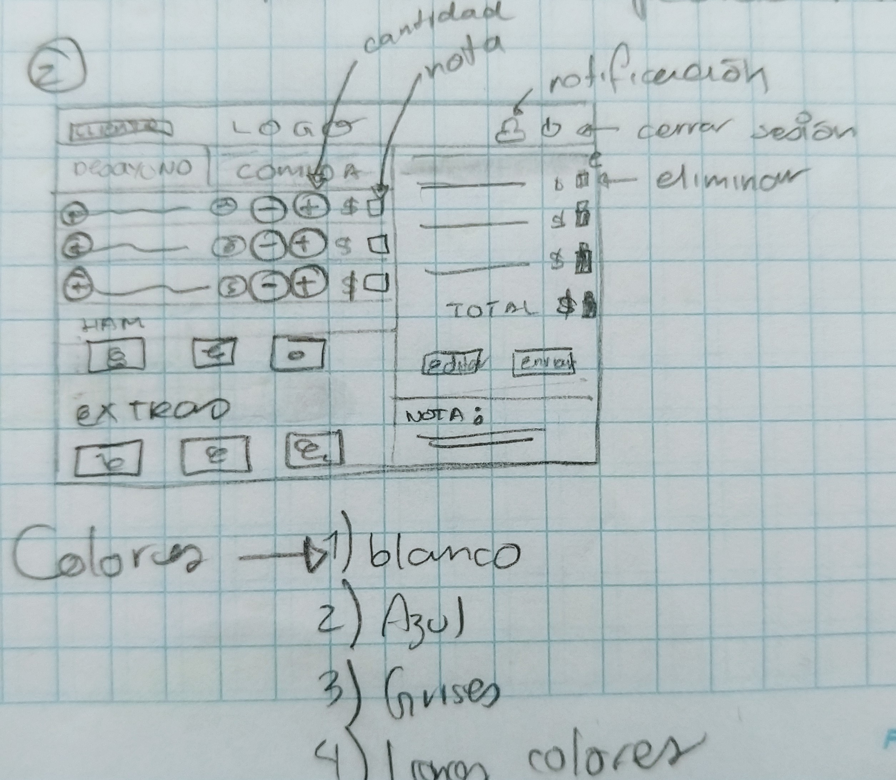

# Burger Queen

## Product definition

Burger queen is a web app to take orders in a hamburger restaurant, it main functions consist in creating different interfaces for the main users that are waiters and cooks in the restaurant. The objective of this project is making an agile catering for the clients through using a tablet.

First interface must allow users to take orders from two different menus and visualize the state of the selected products in a sidebar with a description an individual price and the sum of the total price. Also there should be a button to save and send the orders to kitchen's interface and a link to show an order's status in which the waiters can add a delivered status.

Kitchen's interface should show a tidily resume of the client's orders with descriptions and notes to be serve with efficiency.

##The UI process

Different proptotypes where made, below is shown the process of the low and hight fidelity prototypes.

###Low fidelity prototypes

###High fidelity prototypes
You can go to the next link to interact with high fidelity prototypes.
[Burger Queen hight fidelity prototypes](https://www.figma.com/file/I5a8VhLXchFvtcDaErcV3M0Q/Burger-Queen)

## Use and installation

The demo web app does not require installation, you can go only to the next url.

[Burger Queen](https://itzelmb.github.io/gdl-burger-queen)